# Mestre dos Códigos C# - Escudeiro

Exercícios teóricos estão em um arquivo WORD na Solution. Segue abaixo:

Os exercícios não teóricos estão cada um em um pacote diferente, e todos eles exibirão as opções das ações a serem realizadas.

Exercício 1: 
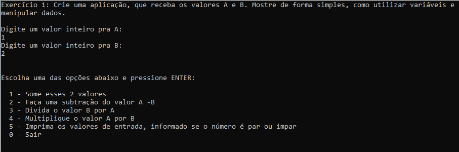

Exercício 2: 
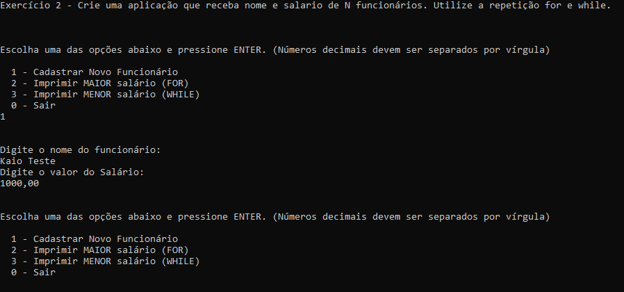

Exercício 3: (Não é necessário ação do usuário a não ser executar o projeto) 
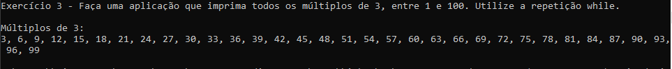

Exercício 4: 
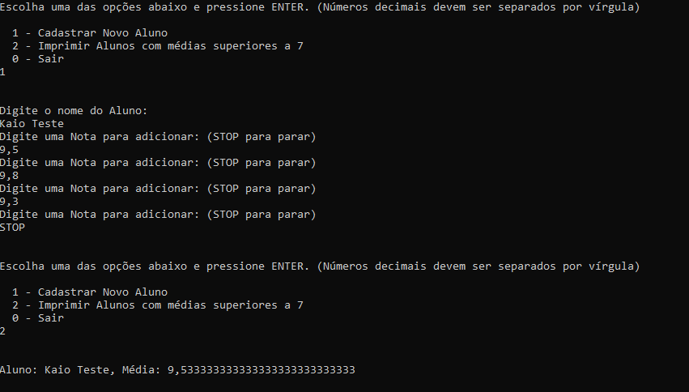

Exercício 5: 
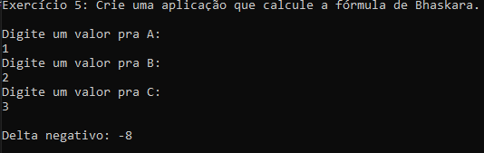

Exercício 6: 
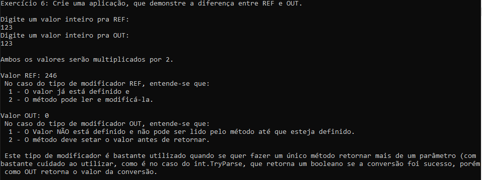

Exercício 7: 
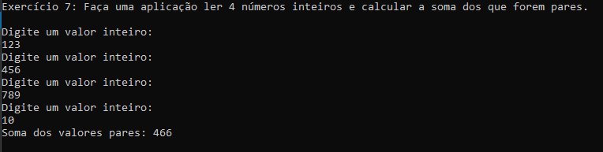

Exercício 8: 
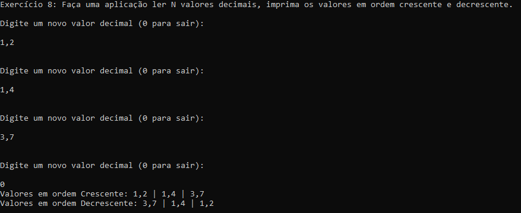

Exercício 9: 
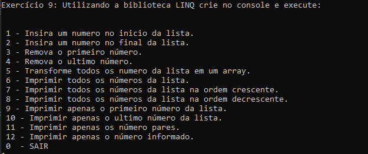

Exercício 2 POO: 
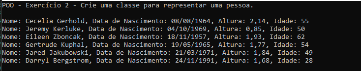

Exercício 3 POO: (Não é necessário ação do usuário a não ser executar o projeto) 
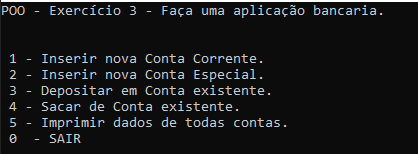

Exercício 4 POO: 
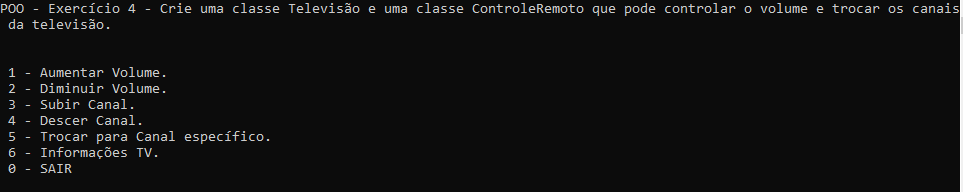

Exercício 2 POO Executado no Linux:  

Pra realizar o build utilizei o comando: 
dotnet publish -c release -r ubuntu.16.04-x64 --self-contained 
Zipei a pasta e coloquei no linux.  

Linux: 
unzip publish.zip 
chmod 777 ./POO_Ex_2 
./POO_Ex_2 

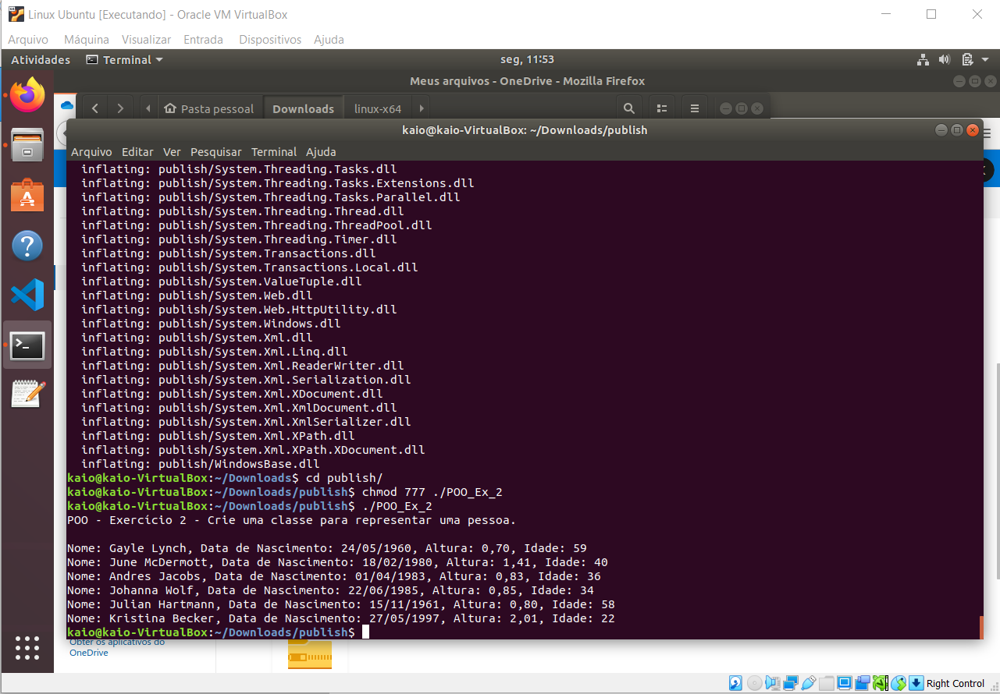
